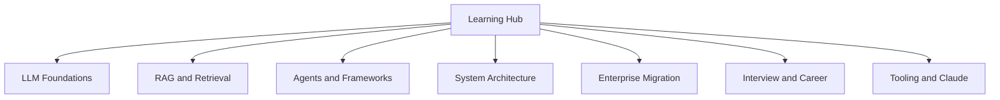

# Reorganize Learning Hub by Topic

> Saved for future reference. Implemented in `pages/learning/index.html` (Aug 2026).
> Original plan: `.cursor/plans/learning_topic_reorg_d6395612.plan.md`

## Approach

Update only [`pages/learning/index.html`](../../pages/learning/index.html): replace the single flat `.learning-grid` with **topic sections**, each with a heading + short blurb, optional **subtopic** labels, and its own card grid. Add a **sticky jump nav** under the hero so users can jump between topics. Keep every existing card (markup, thumbs, links) — only regroup and restyle navigation.

Preserve the current visual language (Syne/DM Sans, navy/accent tokens, card styles). Exception to “no cards” frontend rules: this page already uses learning cards as the interaction containers.

## Topic taxonomy (existing cards only)

### 1. LLM Foundations
- **Core concepts:** LLM Explorer, AI Terms glossary, Self-Attention Explainer
- **Transformers & embeddings:** Positional Encoding (Standalone), Positional Encoding (In-Depth)
- **Fine-tuning:** Fine-Tuning LLMs, Fine-Tuning: Base to Aligned
- **Python for AI:** Python Basics (Offline), Python venv Explained, Pydantic & Agents, Mastering Pydantic

### 2. RAG & Retrieval
- **Architecture:** RAG Architecture, Vector Store vs Vector Database
- **Retrieval techniques:** Retriever Guide, RRF vs Reranker Pipeline
- **Advanced RAG:** CRAG Decision Guide, Agentic RAG with LangGraph
- **System design:** AI/ML Systems — RAG & Agents (Part 2)

### 3. Agents & Frameworks
- **Courses:** AI Pioneers — GenAI & RAG Engineering
- **Agent patterns:** AI Agent Architectures, Agents With Just Python
- **LangChain:** LangChain Ecosystem — Part 1, LangChain Document Model

### 4. System Architecture
- Hub: Architecture Pattern Guides
- Patterns: Distributed Failure Modes, Event-Driven Patterns, Async API Patterns, Container Design Patterns

### 5. Enterprise Migration
- **Cloud / CCT:** CCT Migration Guide, CCT Migration Guide v2
- **Data & BI:** D365 Migration Guide, SSAS → Fabric Migration Proposal, SSAS Migration Costing

### 6. Interview & Career
- Sales SSBI Interview Drill, Azure Integration Architect Interview, AI Engineer Job Portals

### 7. Tooling & Claude
- Claude Code Tutorial, Learn Claude — Full Course

## UI changes in `index.html`

1. **Hero** — tighten subtitle to mention browse-by-topic.
2. **Sticky topic nav** — horizontal chips linking to `#llm-foundations`, `#rag-retrieval`, etc.; sticky below fixed site nav; active state via small IntersectionObserver script (or CSS `:target` fallback).
3. **Sections** — each topic is a `<section id="...">` with:
   - section tag + title + one-line description
   - optional `.subtopic-label` before related card groups
   - `.learning-grid` of the existing articles (move, don’t rewrite content)
4. **CSS** — section spacing, sticky nav, subtopic labels; keep responsive 4/2/1 column grids.
5. **No new pages** — do not add Andela, AIS folder extras, or other unlisted HTML.

## Section IDs (implemented)

| Topic | Anchor |
|-------|--------|
| LLM Foundations | `#llm-foundations` |
| RAG & Retrieval | `#rag-retrieval` |
| Agents & Frameworks | `#agents-frameworks` |
| System Architecture | `#system-architecture` |
| Enterprise Migration | `#enterprise-migration` |
| Interview & Career | `#interview-career` |
| Tooling & Claude | `#tooling-claude` |

## Out of scope

- Moving or renaming HTML files under `pages/ai-learning/` or `pages/migration/`
- Adding unlisted learning resources
- Changing individual learning page content
